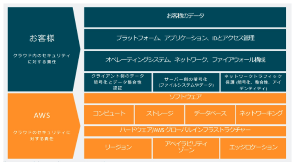
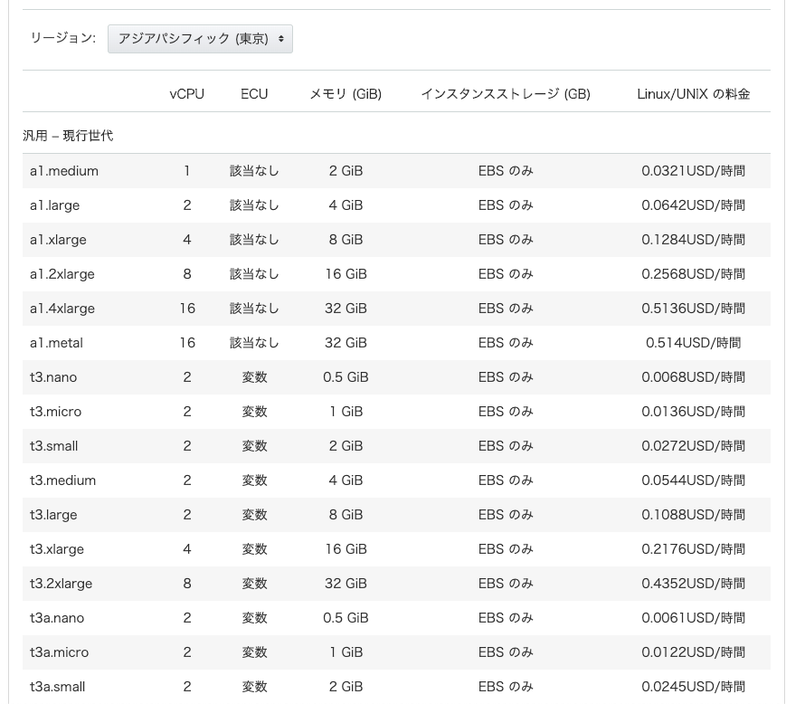

# 0. Fundamental Concept
AWSなどのクラウドインフラを使っていくにあたって重要な考え方とかを紹介する。

一般的なアーキテクチャをクラウドインフラで構築すること自体はそんなに難しくない（極論、AWSのwebコンソールからポチポチすれば作れる）。

一方でクラウドインフラの思想や背景などを理解していないと運用で困る羽目になるので、その手助けになれば幸いである。

## 1. マネージド・サービス
クラウドインフラでは基本的に、そのサービス（例：RDS, EC2など）の（OSレイヤー辺りまでの）管理は全てクラウドベンダーがやってくれる。

クラウドインフラの利用者（我々インフラエンジニア）は面倒なOS周りの設定やアップデートやバックアップなどをほとんど気にする必要がない。基本的にはクラウドベンダーが勝手にやってくれる or 更新用のボタンをwebコンソールから押せば対応が完了する。

クラウドインフラ利用者にとってクラウドインフラを使うことの利点としてはおよそ以下

- 煩雑なインフラそのものの構築やメンテの大半をクラウドインフラ側でやってくれる
  - インフラ管理の歴史はまた別の機会に紹介
- 基本的にデフォルトでかなりチューニングされたサービスを利用できる
  - 例えばAurora RDSであれば、表向きにはMySQLやPostgreSQLの皮を被っているが、中身はAWSが魔改造しているので中規模サービスくらいまでなら何もしなくても耐えられたりする
- 自分たちは貴重な時間をアプリケーションのビジネスロジックを組み込むことにより集中できる
  - そもそもインフラそのもののメンテを行っても自社の売上に繋がることはそれほどないはず（マイナスは避けられるがプラスは生みにくい）

注意点としては、サービス単体（例：RDS）のメンテナンスはしてくれるが、サービスの負荷分散や冗長化などは利用者が設計する必要がある（`クラウドベンダーの責任範囲`で後述）。

### 参考
- [AWS Managed Services](https://aws.amazon.com/jp/managed-services/)

## 2. マイクロサービス
AWSが出している各サービスはマイクロサービスで構成されている。具体的には、RDSとDynamoDBは別のサービスとして切り出されているので、RDSに障害が発生してもDynamoDBには影響を及ぼさない用にできているのだ。

AWSのように非常に大規模なサービス群ともなると、一枚岩なアーキテクチャだと1つの障害で全てのサービスに影響を与えてしまうので、非常に理にかなった構成なのだろう。

マイクロサービスで構成されているということは、それぞれのサービスが明確な役割を持っていることになる。
クラウドインフラの利用者（我々インフラエンジニア）は、`サービス毎の責任を理解した上で`、それらをいい感じに組み合わせてサービスを作る必要がある。

また、各サービスがマイクロサービス化されていることもあり、基本的にAPI経由でのアクセスが可能である。
SDKなどを通してAPIベースでAWSの各リソースにアクセスすることが出来る（webコンソールからポチポチしなくて済む）。

（余談）

マイクロサービスが故、各サービス毎にwebコンソールでのお作法が違う。
例えば、リソースの削除の際に `delete me` と入力させるものもあれば、リソース名を入力させるものもある。
良くも悪くもマイクロサービスなので、各サービスごとにルールなどは別になってる（AWSの中の人も言ってる）。

## 3. クラウドベンダーの責任範囲
### 3-1. 責任共有モデル
AWSは公式で責任共有モデルというものを公開している（以下、公式から拝借）。
要は、AWS側が負うべき責任範囲と、利用者が負うべき責任範囲を提示している。

AWSはこの思想のもとにサービスを提供しているため、サービス利用者もこの考えのもと自分たちのアプリケーションを構築していく必要がある。

#### 参考
- [責任共有モデル](https://aws.amazon.com/jp/compliance/shared-responsibility-model/)
- [責任共有モデルとは何か、を改めて考える](https://aws.amazon.com/jp/blogs/news/rethinksharedresponsibility/)

### 3-2. SLA
一般的にソフトウェアにはSLA（Service Level Agreement）というものが定められている。

これはソフトウェアベンダーが「年間のサービスのダウンタイム（サービス障害などでサービスが使えない状態）を総稼働時間のN%以内となるように運用します」という感じのものであり、一般的には99.N%で設けられる。

これはAWSも持っていて、[AWSのほとんどのサービス（100個以上！）でSLAが設定されてます](https://dev.classmethod.jp/articles/sla-for-more-than-100-aws-services/)にいい感じに載っている（殆どのサービスは99.9%を保証している）。

SLAを破ってしまった場合にはサービスクレジット返還がなされる。
要は、返金処理で済まされる。

ただしサービスクレジット返還の対象になるには複数AZに対してサービスの配置を行ったり、複数エンドポイントへの接続が失われるなどベストプラクティスに準じている必要がある。

そのため、「クラウドインフラだから全部ベンダーが面倒見てくれるし、何かあれば彼らが何とかしてくれる」などとは思わないほうが良い。
その逆で`サービスは落ちる前提`で設計することが重要になる（冗長化とかの話に繋がる）。

ただし、障害に対して入念に備えることは固定費の増加にも繋がるので、そこは組織のお財布や優先度によって調整するべき事項である（組織によって最適解は変わる）。

## 4. 料金体系
AWSの料金体系はサービスによって異なるので一概には言えないが、基本的には`使った分だけ課金`される。要は、`リソースを起動させていた時間`に対して課金されることが多い。
リソースのインスタンスサイズ毎に料金が設定されており、使った分だけ加算される（課金は10分や1分単位くらいだった気がする）。

基本的には各サービスごとに料金体系が記載されているので、そちらを参考にすること。

例えば以下はEC2の料金表

### 参考
[Amazon EC2 料金表](https://aws.amazon.com/jp/ec2/pricing/on-demand/)

## 5. 情報源
基本的にはクラウドベンダーがサービス毎のチュートリアル/デザインパターン/ベストプラクティスなどを公開している。サービスは日々更新されており、最新情報に沿わないとうまく行かないこともあるので、Qiitaとかで調べる前に一度公式のものを覗いてみることをオススメする。

なお、サービスの性質上一般的なデザインパターンやプラクティスが適応できなさそうな場合には、AWSサポートで相談もできる（有料）。

### 参考
- [AWS サポートのプラン比較](https://aws.amazon.com/jp/premiumsupport/plans/)

### 6. まとめ
- クラウドインフラに関する重要かつ基本的な概念を紹介した
- クラウドインフラはすべてをベンダーが面倒見てくれるわけではなく、ベンダーと我々利用者で責任分けがなされている
  - 特に責任共有モデルに関しては一読の価値がある
