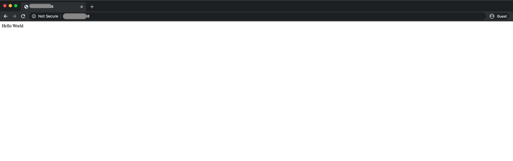

# 2. Network
EC2を構築するために必要なネットワーク周りを紹介しつつ、EC2にインスタンスを構築するハンズオンを行う。

## 2-1. キーワード
ゼロからEC2を構築するまでに必要そうなキーワードを軽く紹介する。
基本的にはAWS公式で丁寧に解説されているので、気になる方はそちらも参考にすることをお勧めする。

アベイラビリティーゾーンまでの粒度は以下のようなイメージ


*出所:[VPC とサブネット](https://docs.aws.amazon.com/ja_jp/vpc/latest/userguide/VPC_Subnets.html)

ルートテーブルまでの粒度は以下のイメージ


*出所:[VPC とサブネット](https://docs.aws.amazon.com/ja_jp/vpc/latest/userguide/VPC_Subnets.html)

### リージョン
AWSは世界各国にデータセンターを持っていて、それらをグルーピングしたもの。リージョンが一番大きな単位となる。
リージョン間は完全に分離されているので、リージョンAで障害があってもリージョンBには影響しない作りになっているらしい。

### アベイラビリティーゾーン
リージョン内に存在する個々の独立したデータセンターのことである。各データセンターは、冗長電源、ネットワーク、接続機能を備えている。

AZと略されることが多い。

EC2などの上にアプリケーションを展開する際には、複数のAZに跨ってアプリケーションを構築することで、自然災害やデータセンター単位の障害による影響を回避することが出来る（いわゆる可用性、耐障害性、スケーラビリティを高めることができる）。

一つのAZ上で運用するスタイルを`Single-AZ`、複数のAZ上で運用するスタイルを`Multi-AZ`という。

### VPC
VPCはAmazon Virtual Private Cloudの略語であり、仮想ネットワークを提供してくれる。

AWSクラウドの広い土地を論理的に分割でき、VPCの中でIPアドレス範囲の選択/サブネットの作成/ルートテーブルやネットワークゲートウェイの設定など、仮想ネットワーキング環境を構築することができる。

VPCは一つのリージョンに対して構築する。

要は「ここの範囲の土地はオレのもの」という区画を引くためのものである。

いわゆるサーバーレス系（Lambda/AppSync?など）のアプリケーション以外では、基本的に利用者（エンジニア）がVPCの中にアプリケーションを構築するためのリソースを構築する必要がある。

なお、AWSのサービスによってVPC依存のものとVPC非依存のものがある（例：S3はVPC非依存）ので、そこら辺は各種サービスを調べて頂きたい。

### サブネット
VPCのIPアドレスの範囲のこと。VPCは大きな土地なのだけれど、その土地を用途ごとに区切るためにサブネットがある。

例えばインターネットと接続するためのリソース用に`public subnet`、インターネットと接続したくないリソースを配置するために `private subnet`というような使い方をする。

### ルートテーブル
ネットワークトラフィックの経路を判断する際に使用される、`ルート`と呼ばれる一連のルール。アクセスがどこから来てどこへ流すのかを定義する。

これがないと、インターネットから来たトラフィックをどこに流せば良いのか分からない。
また逆に、VPC内部に存在するアプリケーションがレスポンスする際にも、このルートを辿ってインターネットにまで到達する必要がある。

### インターネットゲートウェイ
VPC内のリソースとインターネット間の通信を可能にするためにVPCにアタッチするゲートウェイ。

コイツのおかげでインターネット越しにVPC内部のリソースにアクセス出来たりするようになる。

### VPC エンドポイント
PrivateLinkを使用してサポートされているAWSサービスやVPCエンドポイントサービスにVPCをプライベートに接続できる。
インターネットゲートウェイ、NAT デバイス、VPN 接続、または AWS Direct Connect 接続は必要ない。

S3などのVPCの概念を持たないAWSサービスをVPC内部から使用したい場合などに使用する。

### IAM
#### IAM Role
AWS サービスやアプリケーションに対してAWSの操作権限を与える仕組み。

#### IAMポリシー
AWSリソースへのアクセス権限を制御権限をまとめたもの。

Json形式で記述でき、Action(どのサー ビスの) 、Resource(どういう機能や範囲を)、Effect(許可 or 拒否)という3つの大きなルールに基づいて、AWSの各サービスを利用する上での 様々な権限を設定する。

### Security Group
インスタンスの仮想ファイアウォールとして機能し、インバウンドトラフィック（外部からAWSリソースへのアクセス）とアウトバウンドトラフィック（AWSリソースから外部へのアクセス）をコントロールする。アクセス制限は基本的にSecurity Groupを使ってかける。

許可ルールを指定できる（拒否ルールは指定できない）。

セキュリティグループは、サブネットレベルでなくインスタンスレベルで動作する。このため、VPC内のサブネット内のインスタンスごとに異なるセキュリティグループのセットに割り当てることができる。

### Rouet 53
DNS

### ELB
いわゆるロードバランサーのこと。
アプリケーションへのトラフィックを複数のターゲット (Amazon EC2 インスタンス、コンテナ、IP アドレス、Lambda 関数など) に自動的に分散してくれる。

### EC2
Elastic Compute Cloudの略で、一般的にEC2と呼ばれる。

簡単に言うとアプリケーションを構築するための仮想環境を提供してくれる。

EC2に展開した仮想環境のことをインスタンスと呼び、我々インフラエンジニアはこのインスタンス上にアプリケーションを構築する。

### 参考
- [リージョン、アベイラビリティーゾーン、および ローカルゾーン](https://docs.aws.amazon.com/ja_jp/AWSEC2/latest/UserGuide/using-regions-availability-zones.html)
- [Amazon Virtual Private Cloud](https://aws.amazon.com/jp/vpc/)
- [Amazon VPC とは?](https://docs.aws.amazon.com/ja_jp/vpc/latest/userguide/what-is-amazon-vpc.html)
- [VPC のセキュリティグループ](https://docs.aws.amazon.com/ja_jp/vpc/latest/userguide/VPC_SecurityGroups.html)

## 2-2. 設計のポイント
- CIDRのアサインに注意する
  - 既存のVPCとの衝突や将来のことを考慮する
- Multi AZ運用
  - 冗長化/可用性/スケーラビリティ
- セキュリティ対策を適応する
  - [AWS セキュリティのベストプラクティス](https://www.wafcharm.com/blog/aws-security-best-practice/)を一読することをお勧めする
- システムの境界をデザインする
  - 将来のことも見据える

### 参考
- [VPC のセキュリティのベストプラクティス](https://docs.aws.amazon.com/ja_jp/vpc/latest/userguide/vpc-security-best-practices.html)

## 2-3. ハンズオン
ここからはTerraformを使ってゼロからEC2を構築していく。

### 2-3-1. Terraformの基本
- Terraformは拡張子が`tf`
  - 基本的には `xxx.tf` ファイルに定義を追加/編集する
- Terraformを適応する際には`plan`と`apply`がある
  - `plan`はDRY RUNであり、実行される予定の差分が表示される（実行はされない）
  - `apply`はTerraformで定義したリソースをクラウド環境に適応する
- クラウド上のリソースを削除したい場合には `destroy`を使う
- できるだけ安全に進めるのが良さげなので、`-target`オプションを使って実行したい対象のリソースを絞るのがおすすめ
  - 決してベストプラクティスではないので、その辺りは調べてみてください
- plan
  - `terraform plan -target=${resource}` で対象のリソースの実行計画を見て差分が意図通りか確認する
    - 例：`terraform plan -target=aws_vpc.infra-study-vpc`
    - 複数のリソースを指定する場合には、`-target={aws_vpc.infra-study-vpc,aws_internet_gateway.infra-study-igw}` みたいにすればOK
- apply
  - `terraform apply -target=${resource}` で対象のリソースをAWS環境に反映させる
    - 例：`terraform apply -target=aws_vpc.infra-study-vpc`
    - 複数のリソースを指定する場合には、 `-target={aws_vpc.infra-study-vpc,aws_eip.genkan-eip}` みたいにすればOK
- destroy
  - `terraform plan -destroy -target={}`で対象のクラウド上のリソースを削除する際のDRY RUNが出来る
  - `terraform destroy -target={}`で対象のクラウド上のリソースを削除できる
- `xxx.tfstate` ファイルはterraformコマンドを通じてのみ変更を反映するもの（マイグレーションのスキーマみたいなやつ）
  - 絶対に手動で変更しないこと！

### 2-3-2. セットアップ
#### terraform init
`./terraform`配下で `./bin/setup.sh`を実行する

#### EC2のキーペア作成
EC2にsshログインする場合には予め秘密鍵を作っておく必要があるので、[Amazon EC2 キーペアと Linux インスタンス](https://docs.aws.amazon.com/ja_jp/AWSEC2/latest/UserGuide/ec2-key-pairs.html)を参考にしてキーペアを作成しておくこと。

作成したキーをローカルに設定した上で、`./terraform/main.tf`の`aws_instance.infra-study`の`key_name`にその名前を設定する。
これで、Terraformを使って起動したEC2インスタンスとキーペアが紐付けられる。

#### インバウンドアクセス制限
起動したEC2に対してアクセス制限を行うため、[What Is My IP Address](https://whatismyipaddress.com/)などを参考に、現在インターネットにアクセスしているIPを特定し、`./terraform/main.tf`の`aws_security_group.infra-study-sg`の`ingress.cidr_blocks`にIPを指定する。

デフォルトでは外部からはアクセスできない仕様であるため、かならず何らかのIPを指定する必要がある。

### 2-3-3. リソースを構築
今回は以下の構成のリソースをTerraformを使って構築する（操作は全て`./terraform`配下で行う）。


`main.tf`ファイルに有る記述を一つずつplan/applyしていく。
この際にログに変更差分などが表示されるので見ておくと良い。

```
$ terraform plan -target=aws_vpc.infra-study-vpc
$ terraform apply -target=aws_vpc.infra-study-vpc
```

apply後にAWSコンソールを見て、applyしたリソースが追加されていることを確認する。

sshでEC2にログイン出来ることを確認する（sshログイン時のホスト名は`ec2_user`）。
ssh configの設定はこちらを参照すると良いかもしれない[~/.ssh/configについて](https://qiita.com/passol78/items/2ad123e39efeb1a5286b)。

雰囲気としては以下の感じ

```
Host infra-study
  User ec2-user
  IdentityFile ~/.ssh/xxxxxx.pem
  HostName xx.xxx.xxx.xx
```

ターミナルから以下のようにコマンドを打ってEC2インスタンスにログイン出来ることを確認する。

```
$ ssh infra-study
```

### 2-3-4. EC2上にwebサーバーを起動
sshログインだけでは面白くないので、起動したEC2インスタンスでwebサーバーを起動してみる。

今回はDockerとnode.jsを使う。

Dockerを使わずに必要なリソースを直接EC2インスタンスにインストールしてもよいが、大変なので今回はDockerを使う。
また今回はTerraformでEC2を起動した際にDocker本体をインストールする処理を施してある。

terraformでEC2インスタンスを構築した際にDocker用のセットアップも一緒に実行されるように対応済みであるため（ユーザーデータにスクリプトを設定した）、あとは`src`配下のリソースをEC2に転送する。

git環境を構築するのは手間なので今回はscpコマンドを使用する。`2_network`配下で以下のコマンドを使ってEC2にリソースを転送する。

```
$ scp -r ./src infra-study:/home/ec2-user
```

EC2インスタンスにsshログインすると、直下に`src`ディレクトリが出来上がっているはずである。

`src`配下で`bin/build_image.sh`を実行してDockerイメージのビルドと実行を行ってみる。

```
$ ssh infra-study
$ ls
src
$ cd src/
$ bin/build_image.sh
Sending build context to Docker daemon  9.728kB
Step 1/8 : FROM node:12
 ---> cfcf3e70099d
Step 2/8 : ENV APP_ROOT=/usr/src/app
 ---> Using cache
 ---> f6c6360837fc
Step 3/8 : WORKDIR ${APP_ROOT}
 ---> Using cache
 ---> 11c0411442f7
Step 4/8 : COPY package*.json ./
 ---> Using cache
 ---> 5b63f0e83982
Step 5/8 : RUN npm install
 ---> Using cache
 ---> fad6aa7b1693
Step 6/8 : COPY . ${APP_ROOT}
 ---> Using cache
 ---> e74f67175e70
Step 7/8 : EXPOSE 80
 ---> Using cache
 ---> fda9a5e17006
Step 8/8 : CMD [ "node", "index.js" ]
 ---> Using cache
 ---> 92b2312480b4
Successfully built 92b2312480b4
Successfully tagged sample-node-app:latest
```

ビルドできたら`bin/docker_run.sh`を実行してDockerコンテナを起動する

```
$ bin/docker_run.sh
82ee4aa79014140c7fddafc28760bd74c32a9f3c57ca988287b41bce044cb3dd7
```

これでEC2インスタンスにwebサーバーが起動したはずなので、webブラウザから`http://${IP}/:80`にアクセスしてブラウザに`Hello World`と表示されることを確認する。

IPアドレスはAWSのwebコンソールから該当のEC2インスタンスの詳細情報を開くと載っている。



### 2-3-5. 後片付け
terraform destoryを使ってリソースを削除する。基本的には`terraform/main.tf`を下から消していけばOK

AWSの無料枠を利用している方も多いだろうが、これは期限が過ぎると課金が始まるので、基本的には使った後はリソースを削除しておくことをお勧めする。

## 3. まとめ
- EC2を構築するために必要な各種サービスの紹介と、Terraformを使ってEC2インスタンスを起動してwebサーバーを動かすところまでのハンズオンを行った。
- インフラにおいて難しいのは設計であり、実装部分はTerraformなどでIaCすることによって比較的楽に構築する事ができる。
- 今回ハンズオンではEC2インスタンス上での作業（ライブラリのインストールやコマンド操作など）は出来る限り隠匿したが、それでも面倒な手順を踏む必要があった
  - 業務レベルで動かそうとすると非常に沢山のライブラリやツールを、EC2インスタンスの数の分だけインストールする必要があり、非常に面倒
  - この辺りは構成管理ツールを使うことで簡略化することは可能
