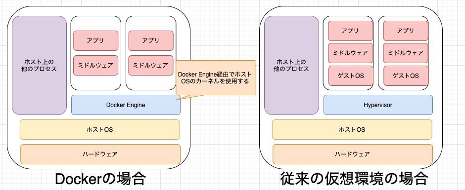
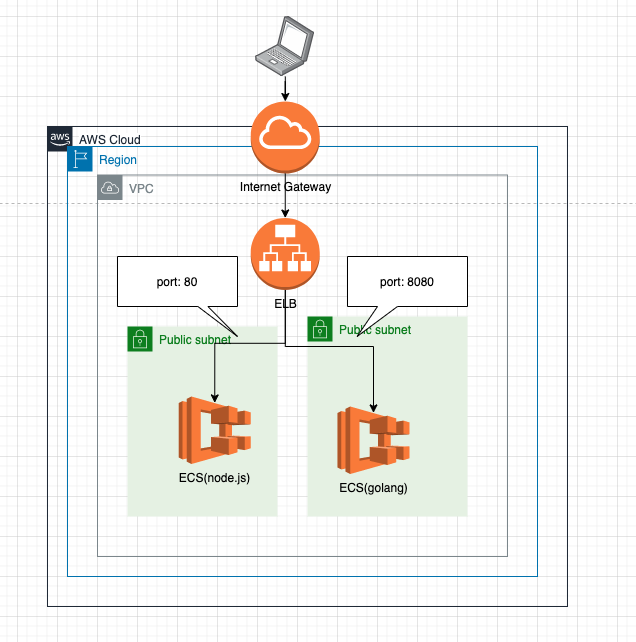

# 3. Container
前章ではEC2周りを見てきた。EC2を使って愚直にアプリケーションを運用しようと思うと色々と面倒事がある。Dockerコンテナ（およびECS）はそんな面倒事を色々と解決してくれる。

この章ではDockerコンテナ（およびECS）に関して紹介し、ECS(Fargate)を使ってハンズオンを行う

## 3-1. コンテナ概略(WIP)
Dockerとは、コンテナ型仮想環境を作成、配布、実行するためのプラットフォーム。Docker社が開発を始め、2013年にオープンソースのプロジェクトとして公開されている。

[公式](https://www.docker.com/)

## 3-2. Dockerコンテナを使うことのメリット
### 3-2-1. 軽量なホストマシン上で隔離された環境を利用できる

**従来までの仮想化環境**
- VirtualBoxなどの従来の仮想化環境ではホストOSの上でHypervisor(仮想化環境を作るための制御プログラム)を利用してゲストOSを動かし、その上にミドルウェアなどを動かしていた
- この方式では、PCの中に別のPC環境を丸ごとインストールする感じなので、非常に重たい!

**Docker**
- Dockerはホストマシン(例:お手元のpc)のカーネルを利用してその上にコンテナを起動するので、仮想化環境に比べて起動や停止が軽量である

イメージとしては以下
)

### 3-2-2. 環境を再現できる
- DockerコンテナはDockerfile(コンテナの設計図)上の情報を元に作成されるので、環境設定をコードとして管理できる
- そのためどの環境（ローカル/検証/本番）でも同じ環境を再現できる

### 3-2-3. スクラップ&ビルドが簡単
- dockerコマンドを使用することでdockerコンテナのビルド/起動/削除などが簡単にできる
- コンテナを作り直すことで何度でも真新しい環境で立ち上がるので、作業中に環境を汚してしまってもすぐに綺麗な環境が手に入る
  - フレームワークのバージョンアップなどの検証に非常に便利

### 3-3. Dockerコンテナを使う上でのポイント
- 1コンテナにつき1プロセス
  - 1つのコンテナ内に複数プロセス(例: Rails, MySQL, Redis)を詰め込むと、コンテナの再起動などが気軽にできない
  - プロセス単位に分離することでコンテナの差し替えが楽になったり、問題が発生した際の影響を最小限に留めることが出来る
- コンテナ上で完結させる
  - 使用するミドルウェアやツールなどはすべてホスト側ではなくコンテナ上で管理すること　
  - これにより、バージョンアップやメンテはDockerfile上で管理できる
- イミュータブル
  - クラウドインフラ同様、コンテナもイミュータブルに保つことで環境差分を減らせる
  - 変更などがある場合にはコンテナを入れ替える

#### 参考文献
- [さくらのナレッジ Docker入門（第一回）～Dockerとは何か、何が良いのか～](https://knowledge.sakura.ad.jp/13265/)
- [Docker導入のための、コンテナの利点を解説した説得資料](https://qiita.com/niisan-tokyo/items/88a53a1b4aa7ad60723e)
- [@IT 第1回　Dockerとは](http://www.atmarkit.co.jp/ait/articles/1701/30/news037.html)
- [Docker とは](https://www.redhat.com/ja/topics/containers/what-is-docker)
- [コンテナってなんだろう― 「コンテナ」の概要を知る](https://thinkit.co.jp/article/17301)

## 3-3. ハンズオン
### 3-3-1. 構成図
今回のハンズオンでは以下のような構成のインフラを構築する。ELBに対してアクセスが来た際、portが80番であればあればnode.jsのアプリケーションにトラフィックを流し、Portが8080番であればGolangのアプリケーションにトラフィックを流すようにする。

### 3-3-2. セットアップ
`./terraform`配下で `./bin/setup.sh`を実行する

### 3-3-3. リソースを構築
`terraform/`配下でリソース毎にapplyを実行していく。ひとまず294行目辺りまで実行していく。

ECRに`infra-study`と`infra-study-2`という2つのレポジトリが構築されるので、

- `infra-study`に`src/node/`配下のDockerfileをビルドしてPush
- `infra-study-2`に`src/go/`配下のDockerfileをビルドしてPush

する。

具体的な手順は[イメージのプッシュ](https://docs.aws.amazon.com/ja_jp/AmazonECR/latest/userguide/docker-push-ecr-image.html)などを参照のこと。

ECRにPushし終えたら、`terraform/config/ecs/`の2つのJsonファイルにそれぞれ`image`というキーが有るので、そこに`aws_ecr_repository`を構築してアプリケーションイメージをECRにPushした際に出来るエンドポイントを入れる（ファイル名とECRのレポジトリ名が対応している）。

295行目以降のリソースもapplyしていく。

全てapplyし終えたら、AWSのwebコンソールからELB(EC2→Load Balancers)を開き、該当のELBのDNS nameを確認する。

DNS nameでPort80番にアクセスして`Hello World from node.js`と返されることを確認する

例：infra-study-0000000.ap-northeast-1.elb.amazonaws.com:80

DNS nameでPort80番にアクセスして`Hello World from Golang`と返されることを確認する

例：infra-study-0000000.ap-northeast-1.elb.amazonaws.com:8080

### 2-4-4. 後片付け
terraform destoryを使ってリソースを削除する。基本的には`terraform/main.tf`を下から消していけばOK

## 3-4. まとめ
- Dockerコンテナ技術の簡単な枠組みとメリットを学んだ
- ECS on Fargateを使って2つのアプリケーションを構築した
