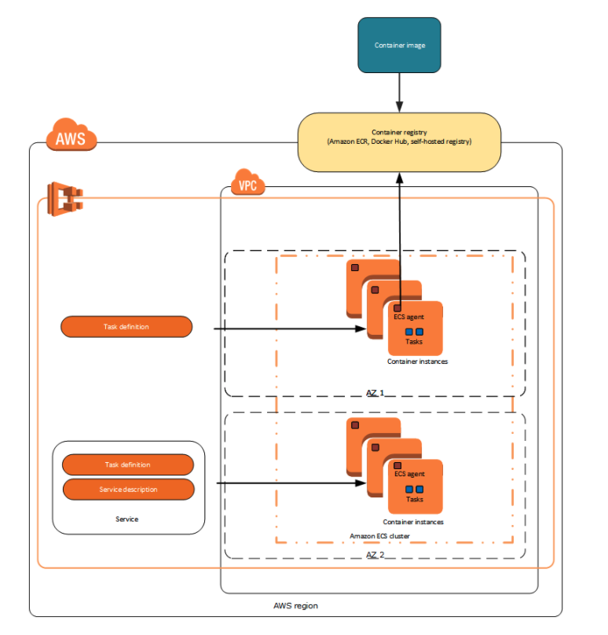
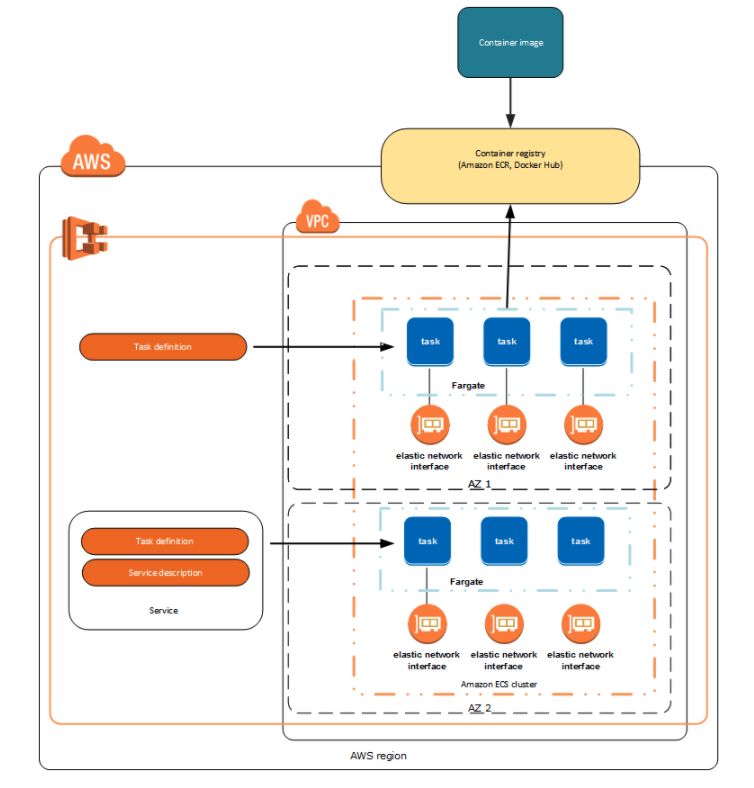

# 3. Container
前章ではEC2周りを見てきた。EC2を使ってその上に愚直にアプリケーションを運用しようと思うと色々と面倒事がある。

Dockerコンテナ（およびECS）はそんな面倒事を色々と解決してくれる（ケースにもよるが、一般的なwebアプリケーションの大半のケースでは使える）。

この章ではDockerコンテナ（およびECS）に関して紹介し、ECS(Fargate)を使ってハンズオンを行う。

## 3-1. Docker概要
Dockerとは、コンテナ型仮想環境を作成、配布、実行するためのプラットフォーム。Docker社が開発を始め、2013年にオープンソースのプロジェクトとして公開されている。

[Docker公式](https://www.docker.com/)

LinuxカーネルとcgroupやNamespaceなどのカーネル機能を使用してコンテナをそれぞれ独立したプロセスとして扱える。これによりそれぞれのコンテナに独立したアプリケーションを展開することができる。

DockerコンテナとホストOSのカーネルとやり取りするため、従来の仮想マシンのようにゲストOSなどが不要なため軽量に独立した環境を用意することが出来る。

### 参考
- [Docker とは](https://www.redhat.com/ja/topics/containers/what-is-docker)
- [コンテナってなんだろう― 「コンテナ」の概要を知る](https://thinkit.co.jp/article/17301)

## 3-2. Dockerコンテナを使うことのメリット
### 3-2-1. 軽量なホストマシン上で隔離された環境を利用できる

**従来までの仮想化環境**
- VirtualBoxなどの従来の仮想化環境ではホストOSの上でHypervisor(仮想化環境を作るための制御プログラム)を利用してゲストOSを動かし、その上にミドルウェアなどを動かしていた
- この方式では、PCの中に別のPC環境を丸ごとインストールする感じなので、非常に重たい!

**Docker**
- Dockerはホストマシン(例:お手元のpc)のカーネルを利用してその上にコンテナを起動するので、仮想化環境に比べて起動や停止が軽量である

イメージとしては以下
)

### 3-2-2. 環境を再現できる
- DockerコンテナはDockerfile(コンテナの設計図)上の情報を元に作成されるので、環境設定をコードとして管理できる
- そのためどの環境（ローカル/検証/本番）でも同じ環境を再現できる

### 3-2-3. スクラップ&ビルドが簡単
- dockerコマンドを使用することでdockerコンテナのビルド/起動/削除などが簡単にできる
- コンテナを作り直すことで何度でも真新しい環境で立ち上がるので、作業中に環境を汚してしまってもすぐに綺麗な環境が手に入る
  - フレームワークのバージョンアップなどの検証に非常に便利

### 3-2-4. Dockerコンテナを使う上でのポイント
- 1コンテナにつき1プロセス
  - 1つのコンテナ内に複数プロセス(例: Rails, MySQL, Redis)を詰め込むと、コンテナの再起動などが気軽にできない
  - プロセス単位に分離することでコンテナの差し替えが楽になったり、問題が発生した際の影響を最小限に留めることが出来る
- コンテナ上で完結させる
  - 使用するミドルウェアやツールなどはすべてホスト側ではなくコンテナ上で管理すること　
  - これにより、バージョンアップやメンテはDockerfile上で管理できる
- イミュータブル
  - クラウドインフラ同様、コンテナもイミュータブルに保つことで環境差分を減らせる
  - 変更などがある場合にはコンテナを入れ替える

#### 参考文献
- [さくらのナレッジ Docker入門（第一回）～Dockerとは何か、何が良いのか～](https://knowledge.sakura.ad.jp/13265/)
- [Docker導入のための、コンテナの利点を解説した説得資料](https://qiita.com/niisan-tokyo/items/88a53a1b4aa7ad60723e)
- [@IT 第1回　Dockerとは](http://www.atmarkit.co.jp/ait/articles/1701/30/news037.html)

## 3-3. ECS
ECSはDockerコンテナの管理を簡単に行えるコンテナ管理サービスである。利用者はデプロイしたいDockerイメージをサービスまたはタスクとして起動して使用する。
ECSにはECSタイプとEC2タイプの2つの起動タイプがある。

ECSタイプではDockerコンテナを配備する対象のEC2インスタンスはAWS側でいい感じに用意してくれる。
Dockerコンテナが動いているEC2にはsshログインなどできない。

EC2タイプではDockerコンテナを配備する対象のEC2インスタンスは自分で管理する。Fargateでは手の届かない細かなカスタマイズがしたい場合にはこちらを選ぶ。
Dockerコンテナが動いているEC2にはsshログインできる。

### 3-3-1. 全体構成
ECSは起動タイプによって構成が異なる

#### EC2タイプ


#### Fargateタイプ


*画像はともに[https://docs.aws.amazon.com/ja_jp/AmazonECS/latest/developerguide/launch_types.html](https://docs.aws.amazon.com/ja_jp/AmazonECS/latest/developerguide/launch_types.html)から拝借

### 3-3-2. 用語
#### クラスター
ECSはクラスターというグループによりリソースを管理している。クラスター単位で起動タイプ（FargateまたはEC2）を選ぶ。

#### タスク定義
ECSでアプリケーションを実行するためにはタスク定義を作成する必要がある。タスク定義をアプリケーションを構成するコンテナの情報（どのDockerイメージを使い、コンテナのスペックやPortなどをどうするか）を定義する。

#### タスクとスケジューリング
タスク定義を元に、クラスター内でタスクを実行する。

中長期実行し続けるアプリケーションサービスを起動する場合には`サービススケジューラ`を定義して実行する。
サービススケジューラにより、指定したスケジュール戦略が順守され、タスクが失敗したときにタスクが再スケジュールされる。

サービススケジューラではアプリケーションの配置先のネットワーク設定やELBとの連携なども行える。

### 参考
- [Amazon Elastic Container Service](https://aws.amazon.com/jp/ecs/)
- [Amazon Elastic Container Service の特徴](https://aws.amazon.com/jp/ecs/features/)
- [Amazon Elastic Container Service とは](https://docs.aws.amazon.com/ja_jp/AmazonECS/latest/developerguide/Welcome.html)
- [Amazon ECS 起動タイプ](https://docs.aws.amazon.com/ja_jp/AmazonECS/latest/developerguide/launch_types.html)
- [Amazon ECS タスクのスケジューリング](https://docs.aws.amazon.com/ja_jp/AmazonECS/latest/developerguide/scheduling_tasks.html)
- [AWSでDockerを扱うためのベストプラクティス](https://www.slideshare.net/AmazonWebServicesJapan/awsdocker)

### 3-3-3. ecspresso
ECSで運用するプロダクトをデプロイする際には以下のようなパターンがある。
※筆者はCodeDeploy未経験のため、CodeDeployにつての解像度は非常に粗い。

- Terraformを利用パターン
  - Terraformリソース(`aws_ecs_task_definition` と `aws_ecs_service`)を利用する
  - Terraformエコシステムに乗せて一気通貫でデプロイできる
  - アプリケーション側でカスタムしたい値（コンテナの設定/image tag/環境変数など）の変更をインフラのライフサイクルに依存させてしまう
- [ecspresso](https://github.com/kayac/ecspresso)を経由するパターン
  - ECS ServiceやTask DefinitionをTerraformエコシステムとは別のライフサイクルで取り扱えるようになる
  - Terraform stateを利用できるため、インフラ固有の情報参照も比較的楽にできる
- CodeDeployを利用するパターン
  - CodeDeployエコシステムが既に出来上がっている場合には便利
  - ECSデプロイに必要な情報を別途管理する必要があり、データの重複管理などが大変
- etc.

その中でとりわけecspressoは手軽に導入でき、その上アプリケーション側のライフサイクルでデプロイできるため非常に使い勝手が良い。そのため、このハンズオンではecspressoを用いてECSデプロイを行う。


## 3-4. ハンズオン
### 3-4-1. 構成図
今回のハンズオンではECS（起動タイプはFargate）を使用して以下のような構成のインフラを構築する。

ELBにアクセスが来た際、Portが80番であればあればnode.jsのアプリケーションにトラフィックを流し、Portが8080番であればGolangのアプリケーションにトラフィックを流すようにする。


### 3-4-2. セットアップ
`./terraform`配下で以下を実施する。

```shell
$ cp backend_example.hcl backend.hcl
# ファイル内の`bucket`や`key`を修正
$ terraform init -backend-config=backend.hcl
$ export TF_VAR_owner="yamada-taro" # リソースの作者を指定
$ export TF_VAR_your_home_ip="" # 自宅のIPを指定
$ terraform plan
$ terraform apply
```

ECRに`nodejs-app-${var.owner}`と`golang-app-${var.owner}`という2つのレポジトリが構築されるので、

- `nodejs-app-${var.owner}`に`src/node/`配下のDockerfileをビルドしてPush
- `golang-app-${var.owner}`に`src/go/`配下のDockerfileをビルドしてPush

する。

具体的な手順は[イメージのプッシュ](https://docs.aws.amazon.com/ja_jp/AmazonECR/latest/userguide/docker-push-ecr-image.html)などを参照のこと。
※ECSから該当のrepositoryを開き、 `View push commands` から具体的な手順を確認できる。

`ecspresso/` 配下で以下を実施することでECS Serviceを起動する

```shell
# コピーしたファイル内のvalueを、自身で指定したものに書き換える
$ cp base.env.example base.env
# ECSをデプロイする
$ ecspresso deploy --config ./nodejs/ecspresso.yml --envfile=base.env
$ ecspresso deploy --config ./golang/ecspresso.yml --envfile=base.env
```

AWSのwebコンソールからELB(EC2→Load Balancers)を開き、該当のELBのDNS nameを確認する。

DNS nameでPort80番にアクセスして`Hello World from node.js`と返されることを確認する

例：infra-study-0000000.ap-northeast-1.elb.amazonaws.com:80

DNS nameでPort80番にアクセスして`Hello World from Golang`と返されることを確認する

例：infra-study-0000000.ap-northeast-1.elb.amazonaws.com:8080

### 3-4-4. 後片付け
`terraform destroy` コマンドを実行することでリソースを削除する。

## 3-5. まとめ
- Dockerコンテナ技術の簡単な枠組みとメリットを学んだ
- ECS on Fargateを使って2つのアプリケーションを構築した
